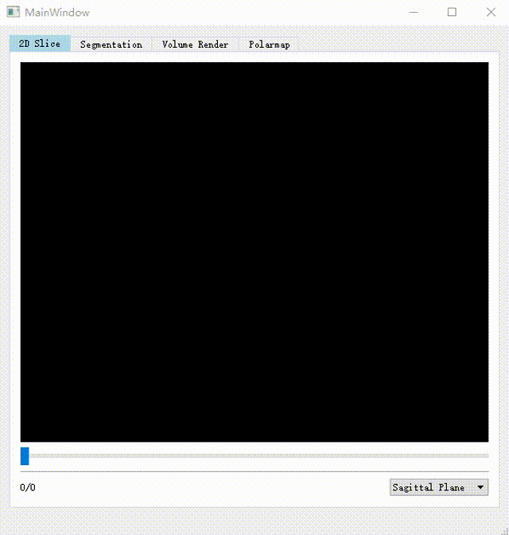

# CPIAS_DL

CPIAS_DL是一个用于PET心肌图像分析的项目，包括基本的可视化模块。我们使用了如下的框架：ITK、VTK、ONNX等。    
开发这个项目的目的是，测试训练好的深度学习模型在更多图像的应用以及可视化其性能表现。

## 项目简介

在这个项目中，我们专注于PET心肌图像的分析和可视化。我们的目标是提供一个强大的工具，可以帮助医生和研究人员更好地理解和解释心肌图像。  

## 快速入门

本项目目前处于早期开发阶段，可以被视为一个简化的系统。目前，我们主要支持NIFTI格式的图像读取，且只能通过鼠标拖拽的方式将图像加载到对应的窗口。

项目主要包含以下三个模块：

- **2D Slice**：提供图像切片的可视化功能。
- **Segmentation**：提供掩膜分割轮廓的可视化功能。
- **Volume Render**：提供掩膜部分的三维体渲染功能。

**注意**：掩膜图像仅支持二值图像，即图像中只能包含两个值：0和1。其中，1代表前景，0代表背景。    
可以使用当前目录下 resource\NIFTI_image 文件夹中的两个图像进行测试使用。   

## 医学图像可视化

我们的项目提供了一些强大的可视化工具，可以帮助你更好地理解和解释医学图像。以下是一些示例：

### PET心肌图像可视化

在这个示例中，我们展示了如何使用我们的工具来可视化PET心肌图像。

### CT全身图像可视化

在这个示例中，我们展示了如何使用我们的工具来可视化CT全身图像。

### PET心肌图像分割可视化

在这个示例中，我们展示了如何使用我们的工具，对PET心肌图像结合心肌分割的mask进行可视化。