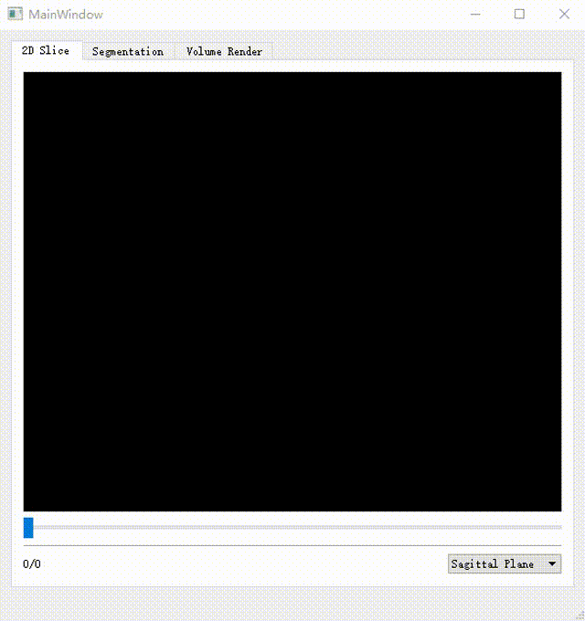
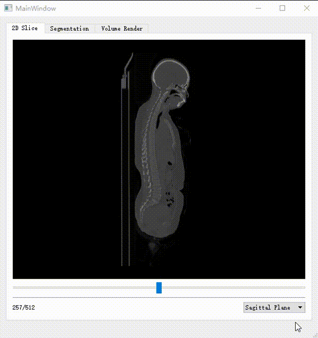

# CPIAS_DL

CPIAS_DL是一个用于PET心肌图像分析的项目，包括基本的可视化模块。我们使用了如下的框架：ITK、VTK、ONNX等。

## 项目简介

在这个项目中，我们专注于PET心肌图像的分析和可视化。我们的目标是提供一个强大的工具，可以帮助医生和研究人员更好地理解和解释心肌图像。

## 医学图像可视化

我们的项目提供了一些强大的可视化工具，可以帮助你更好地理解和解释医学图像。以下是一些示例：

### PET心肌图像可视化

在这个示例中，我们展示了如何使用我们的工具来可视化PET心肌图像。

### CT全身图像可视化

在这个示例中，我们展示了如何使用我们的工具来可视化CT全身图像。